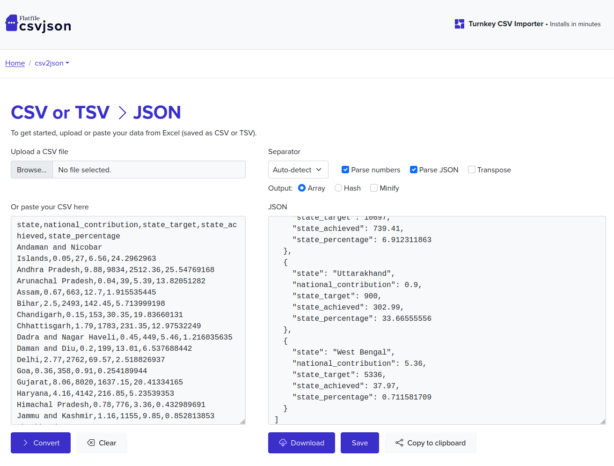

# Indian States
The Wadhwani Chair in U.S. India Policy Studies has commissioned a new website that will provide comprehensive insight into India’s 29 States’ policies as related to key sectors. The website will be a tool for users: an organized knowledge base that will facilitate greater business and economic understanding and engagement between India and the United States.

Users will be able to access data via two avenues of focus: by State or by sector/subsector. In addition to being a compact source of comparative data, the site offers users access to a curated collection of new articles and reports that support and extend their understanding of the State/sector relationship.

## Setup
This website use node v `20.5.0` and ruby v `3.2.2`
1. Clone the repo with `git clone git@github.com:CSIS-iLab/india-states-v2.git` and go to the directory `cd india-states-v2`
2. Run `npm run setup` to install/update bundler dependencies and install the npm dependencies
3. Start development server `npm start`

## Directory Structure
The basic site structure for the site looks like this:
```
.
├── _data
├── _includes
├── _layouts
├── _posts
├── _sass
|   ├── custom
|   ├── minima.scss
├── _sectors
├── _site
├── _states
├── _subsectors
├── _trackers
├── admin
|   ├── config.yml
|   └── index.html
├── assets
|   ├── img
|   └── js
├── .jekyll-metadata
├── _config.yml
├── about.md
├── index.md
├── search.md
├── sectors.md
└── states.md
```
### _data
The `_data` folder contains CSV, JSON, or YAML files that are used throughout the site, but are primarily used to store the data for the National Goal Trackers and the India map geojson. See [Jekyll documentation](https://jekyllrb.com/docs/datafiles/) for more information.

### _includes
The `_includes` folder contains the HTML for the modular pieces of the site's layout that need to be included across multiple pages. For example, `head.html` and `footer.html` are stored here. See [Jekyll documentation](https://jekyllrb.com/docs/includes/) for more information.

### _layouts
The `_layouts` folder contains the HTML for distinctive page layouts. For example, `post.html`, `states.html`, and `sectors.html`. See [Jekyll documentation](https://jekyllrb.com/docs/themes/) for more information.

### _posts
Contains the `.md` files for the news articles/posts. Posts have the the following default front matter:
```
layout: post
content_type: Post
states: 
sectors: 
subsectors: 
sources:
  name: 
  url: 
details:
  name: 
  url:
```
See [Jekyll documentation](https://jekyllrb.com/docs/posts/) for more information.

### _sass
Contains the SASS files for styling the site. As of 2/15/17, the project uses the Minima gem-based theme which means the only files included in this folder are custom sass files specific to the India States project. Likely to get overhauled when the design phase of the site starts. See [Jekyll documentation](https://jekyllrb.com/docs/themes/) for more information.

**Note:** GitHub Pages automatically compiles the SASS files, so don't worry about running a separate compiler.

### _sectors, _states, _subsectors, _trackers
These folders hold the content for their respective content types and are called "collections" in Jekyll terminology. Each state, sector, subsector, etc. gets its own markdown file that contains the relevant front matter and content for that particular item. See [Jekyll documentation](https://jekyllrb.com/docs/collections/) for more information. The default front matter settings for each of these collections is listed below:

#### _sectors
```
layout: sectors
content_type: Sector
```

#### _states
```
layout: states
content_type: State
size: 
population: 
party_affiliation: 
legislative_seats: 
rajya_seats: 
gdp: 
development_indicators:
  mortality: 
  literacy: 
```

#### _subsectors
```
layout: sectors
content_type: Subsector
sector: 
```

#### _trackers
```
layout: trackers
content_type: Tracker
start_date: 
end_date: 
sectors: 
subsectors: 
data_name: 
```

### _site
The compiled site files. This folder is automatically generated by Jekyll's build process. You should not make manual changes to this folder.

### assets
These contain the static assets for the site, including images and JavaScript files. See [Jekyll documentation](https://jekyllrb.com/docs/assets/) for more information.

### [pages].md
Parent level pages on the site, such as `/about`, `/states`, `/sectors`, are created by making a `.md` file in the root directory of the project. See [Jekyll documentation](https://jekyllrb.com/docs/pages/) for more information.

### Branching

When modifying the code base, always make a new branch. Unless it's necessary to do otherwise, all branches should be created off of `dev`.

Branches should use the following naming conventions:

| Branch type               | Name                                                      | Example                     |
| ------------------------- | --------------------------------------------------------- | --------------------------- |
| New Feature               | `feature/<short description of feature>`                  | `feature/header-navigation` |
| Bug Fixes                 | `bug/<short description of bug>`                          | `bug/mobile-navigation`     |
| Documentation             | `docs/<short description of documentation being updated>` | `docs/readme`               |
| Code clean-up/refactoring | `refactor/<short description>`                            | `refactor/apply-linting`    |
| Content Updates           | `content/<short description of content>`                  | `content/add-new-posts`     |

When ready to merge, submit a Pull Request into `main`. All code will be reviewed by the lead developer on the project before being merged into `main`.

### Commit Messages

Write clear and concise commit messages describing the changes you are making and why. If there are any issues associated with the commit, include the issue # in the commit title.

### CSS Styles

This project uses the [BEM](http://getbem.com/introduction/) naming convention.

### How to add a new national goal tracker

The program should send an email will the link to the [spreadsheet](https://docs.google.com/spreadsheets/d/1HjNQrezfHJu88c0rQgYipW7QcJJP3l-b58x0AE_dg_w/edit?usp=sharing).
1. In the spreadsheet go to `File > Download > Comma separated values (.csv)`
2. Open this online [CSV to JSON converter](https://csvjson.com/csv2json) and upload the .cvs previously downloaded  then hit convert. When the JSON field is filled click on the button copy to clipboard

3. Back on your text editor go to the folder `_data/national-goals` and duplicate one of the files open the duplicated file and under the key `"tracker"` paste the JSON generated and save the file.
4. Rename the file to reflect the new national goal tracker e.g. `name-performance-tracker.json`
5. Now find the new National Goal added by the program. It should be under the `_national-goals` folder open it and update the `data_source: "{{replace-this-with-data-name}}"` with the name of new data file created `name-performance-tracker` without the `.json` so it should look something like `data_source: name-performance-tracker` and save it.
Now the changes should be reflected on the website.
6. Add the new file to the CMS so the program can make any edits from there. Open `admin/config.yml` go to the trackers collections and duplicate the last tracker and update accordingly to the new file
Last tracker:
```yml
- label: "Wind Tracker"
  name: "wind-tracker"
  file: "_data/national-goals/wind-performance-tracker.json"
  fields:
    - label: 'states'
      name: 'tracker'
      widget: 'list'
      allow_add: false
      collapsed: true
      fields:
        - { name: 'state' }
        - { name: 'national_contribution' }
        - { name: 'state_target' }
        - { name: 'state_achieved' }
        - { name: 'state_percentage' }
```
New tracker
```yml
- label: "Name Tracker"
  name: "name-tracker"
  file: "_data/national-goals/name-performance-tracker.json"
  fields:
    - label: 'states'
      name: 'tracker' #Dont change this.
      widget: 'list'
      allow_add: false
      collapsed: true
      fields:
        - { name: 'state' }
        - { name: 'national_contribution' }
        - { name: 'state_target' }
        - { name: 'state_achieved' }
        - { name: 'state_percentage' }
```
You should only update the `label, name, file`


### Script to change filenames extension

This project has files that have markdown extension and it's not recognized by the CMS. This script  will loop through each file inside a directory and change it from `filename.markdown` to `filename.md`

```Shell
for f in *.markdown; do mv -- "$f" "${f%.markdown}.md"; done
```

### Copy

from here <https://unix.stackexchange.com/questions/495878/copy-files-with-match-prefix-and-suffix-with-shell-script>

```shell
grep '^2017.*\.md$' list.txt | xargs -I '{}' cp '{}' _posts/2017/
```
when inside the folder just do
```shel
cp 2023*.md 2023/ 
```
where cp is copy 
2023*.md is selecting all the files that start with 2023 and ends with .md
2023/ is the destination folder

### Copyright / License

Copyright © 2022 CSIS iDeas Lab under the [License](LICENSE).
